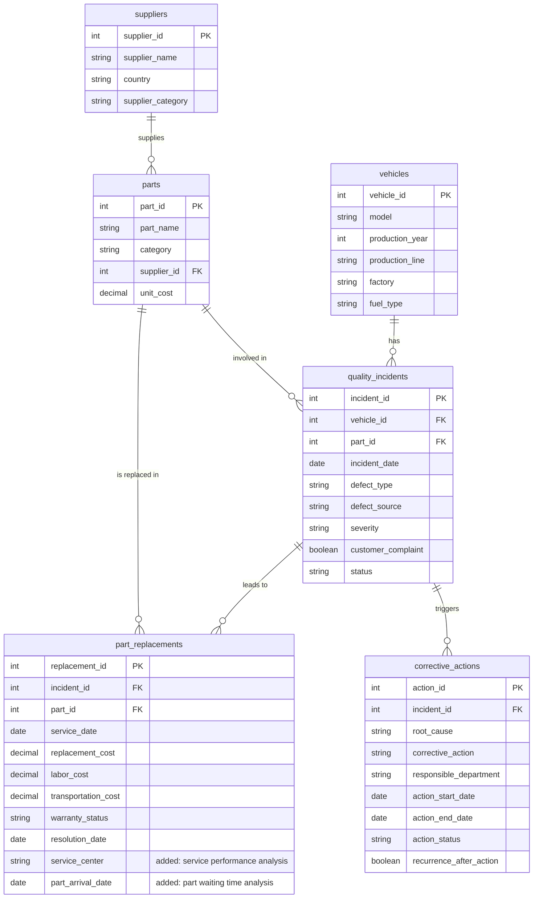

# ER Diagram

Entity-relationship diagram for the AutoInsight database (v1 draft).

## Relationships

| Relationship | Meaning |
|--------------|---------|
| `suppliers` → `parts` | One supplier supplies many parts; each part has one supplier. |
| `vehicles` → `quality_incidents` | One vehicle can have many quality incidents. |
| `parts` → `quality_incidents` | One part can be involved in many incidents. |
| `quality_incidents` → `part_replacements` | One incident can lead to zero or more part replacements (not every incident needs a replacement, which is why there are fewer replacements than incidents). |
| `parts` → `part_replacements` | One part can be replaced many times. |
| `quality_incidents` → `corrective_actions` | One incident can trigger zero or more corrective actions. |

## Design Notes

- **`part_id` in both `quality_incidents` and `part_replacements`:** kept on purpose. The incident records which part failed; the replacement records which part was actually replaced. In the generated data they will usually match, and an incident could involve more than one replaced part.
- **`service_center` (added):** the original schema had no way to answer "which service takes longer to complete repairs?". Values will be generic (Service Center 1, 2, ...).
- **`part_arrival_date` (added):** needed to answer "does part waiting time affect resolution time?" (waiting time = `part_arrival_date` − `service_date`).
- **Resolution time** is calculated as `resolution_date` − `incident_date`.
- **Total quality cost** per replacement = `replacement_cost` + `labor_cost` + `transportation_cost` (all in TRY).